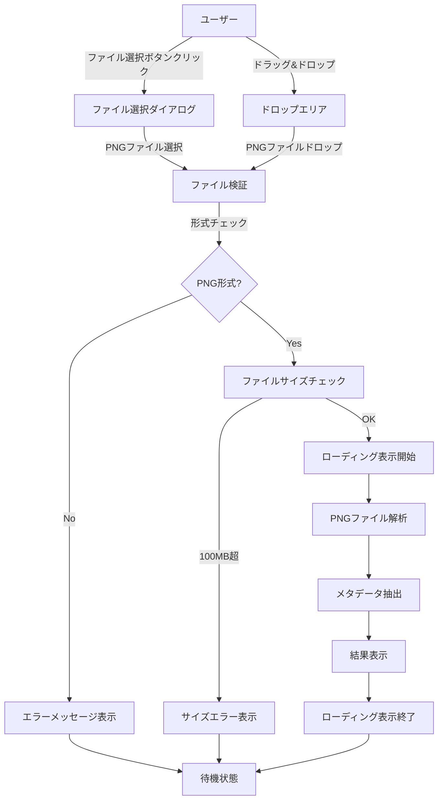
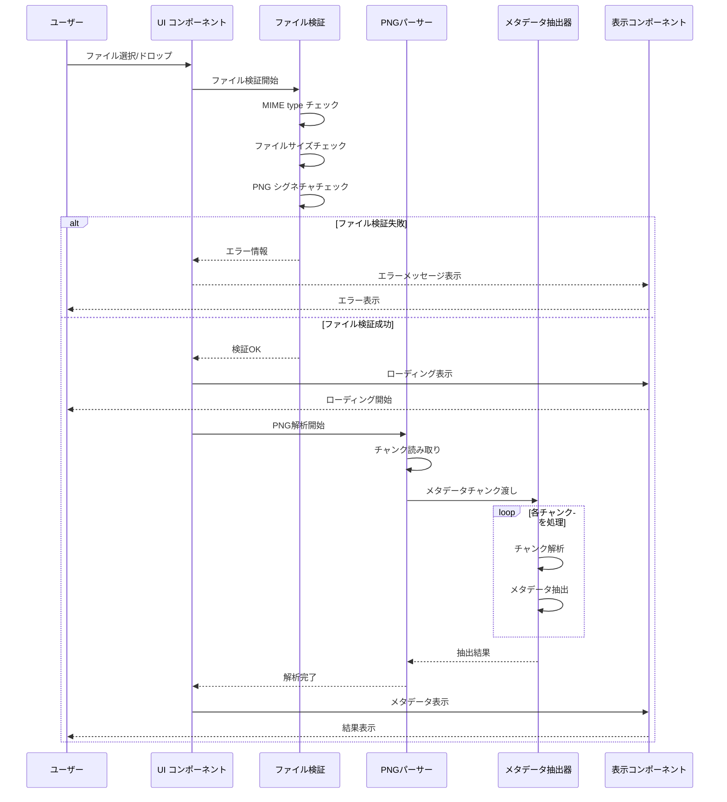
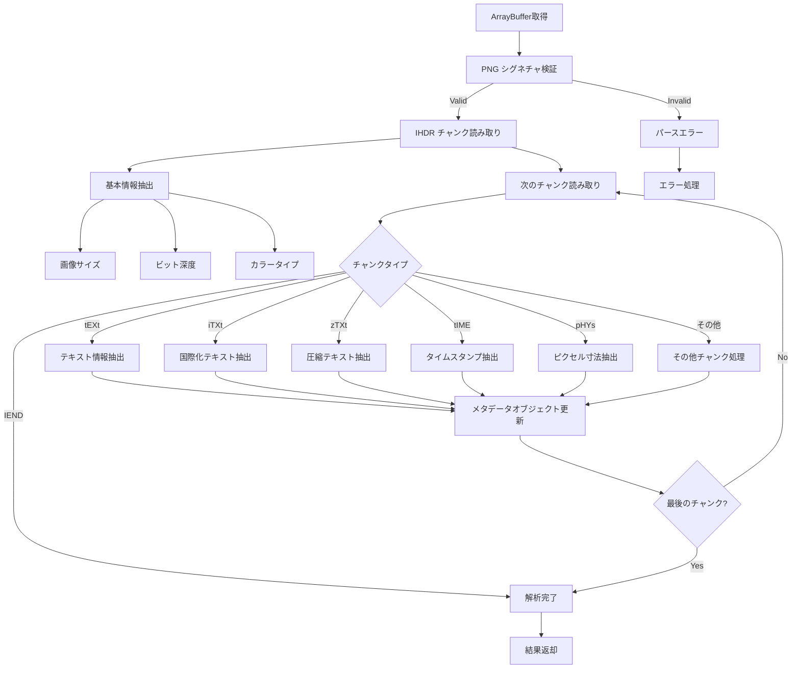
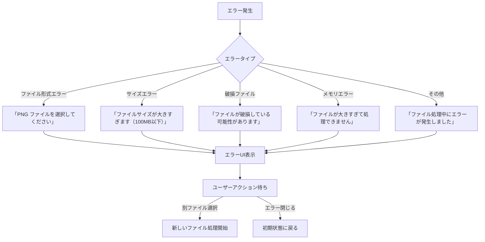
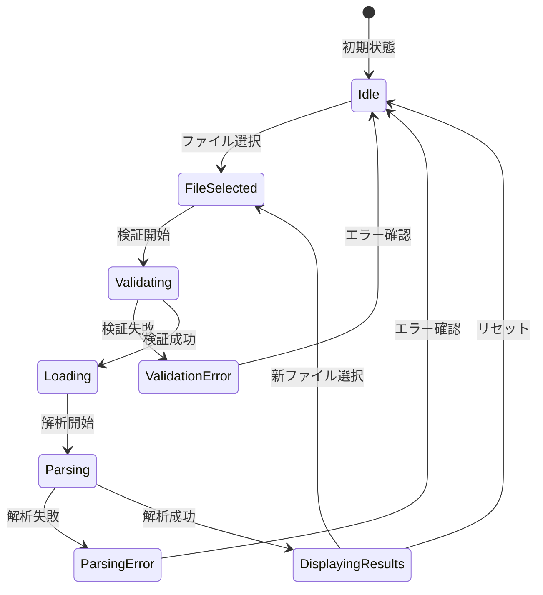
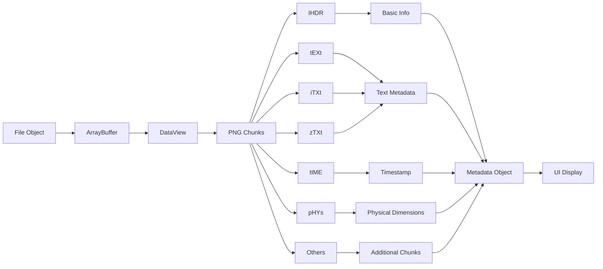

# PNGメタデータ表示機能 データフロー図

## ユーザーインタラクションフロー

```mermaid
flowchart TD
    A[ユーザー] -->|ファイル選択ボタンクリック| B[ファイル選択ダイアログ]
    A -->|ドラッグ&ドロップ| C[ドロップエリア]
    B -->|PNGファイル選択| D[ファイル検証]
    C -->|PNGファイルドロップ| D
    
    D -->|形式チェック| E{PNG形式?}
    E -->|No| F[エラーメッセージ表示]
    E -->|Yes| G[ファイルサイズチェック]
    
    G -->|100MB超| H[サイズエラー表示]
    G -->|OK| I[ローディング表示開始]
    
    I --> J[PNGファイル解析]
    J --> K[メタデータ抽出]
    K --> L[結果表示]
    L --> M[ローディング表示終了]
    
    F --> N[待機状態]
    H --> N
    M --> N
```

## ファイル処理フロー

```mermaid
sequenceDiagram
    participant U as ユーザー
    participant UI as UI コンポーネント
    participant V as ファイル検証
    participant P as PNGパーサー
    participant M as メタデータ抽出器
    participant D as 表示コンポーネント
    
    U->>UI: ファイル選択/ドロップ
    UI->>V: ファイル検証開始
    
    V->>V: MIME type チェック
    V->>V: ファイルサイズチェック
    V->>V: PNG シグネチャチェック
    
    alt ファイル検証失敗
        V-->>UI: エラー情報
        UI-->>D: エラーメッセージ表示
        D-->>U: エラー表示
    else ファイル検証成功
        V-->>UI: 検証OK
        UI->>D: ローディング表示
        D-->>U: ローディング開始
        
        UI->>P: PNG解析開始
        P->>P: チャンク読み取り
        P->>M: メタデータチャンク渡し
        
        loop 各チャンクを処理
            M->>M: チャンク解析
            M->>M: メタデータ抽出
        end
        
        M-->>P: 抽出結果
        P-->>UI: 解析完了
        UI->>D: メタデータ表示
        D-->>U: 結果表示
    end
```

## PNGファイル解析フロー

```mermaid
flowchart TD
    A[ArrayBuffer取得] --> B[PNG シグネチャ検証]
    B -->|Invalid| C[パースエラー]
    B -->|Valid| D[IHDR チャンク読み取り]
    
    D --> E[基本情報抽出]
    E --> F[画像サイズ]
    E --> G[ビット深度]
    E --> H[カラータイプ]
    
    D --> I[次のチャンク読み取り]
    I --> J{チャンクタイプ}
    
    J -->|tEXt| K[テキスト情報抽出]
    J -->|iTXt| L[国際化テキスト抽出]
    J -->|zTXt| M[圧縮テキスト抽出]
    J -->|tIME| N[タイムスタンプ抽出]
    J -->|pHYs| O[ピクセル寸法抽出]
    J -->|IEND| P[解析完了]
    J -->|その他| Q[その他チャンク処理]
    
    K --> R[メタデータオブジェクト更新]
    L --> R
    M --> R
    N --> R
    O --> R
    Q --> R
    
    R --> S{最後のチャンク?}
    S -->|No| I
    S -->|Yes| P
    
    C --> T[エラー処理]
    P --> U[結果返却]
```

## エラーハンドリングフロー

```mermaid
flowchart TD
    A[エラー発生] --> B{エラータイプ}
    
    B -->|ファイル形式エラー| C[「PNG ファイルを選択してください」]
    B -->|サイズエラー| D[「ファイルサイズが大きすぎます（100MB以下）」]
    B -->|破損ファイル| E[「ファイルが破損している可能性があります」]
    B -->|メモリエラー| F[「ファイルが大きすぎて処理できません」]
    B -->|その他| G[「ファイル処理中にエラーが発生しました」]
    
    C --> H[エラーUI表示]
    D --> H
    E --> H
    F --> H
    G --> H
    
    H --> I[ユーザーアクション待ち]
    I -->|別ファイル選択| J[新しいファイル処理開始]
    I -->|エラー閉じる| K[初期状態に戻る]
```

## 状態管理フロー

```mermaid
stateDiagram-v2
    [*] --> Idle: 初期状態
    
    Idle --> FileSelected: ファイル選択
    FileSelected --> Validating: 検証開始
    
    Validating --> ValidationError: 検証失敗
    Validating --> Loading: 検証成功
    
    Loading --> Parsing: 解析開始
    Parsing --> ParsingError: 解析失敗
    Parsing --> DisplayingResults: 解析成功
    
    ValidationError --> Idle: エラー確認
    ParsingError --> Idle: エラー確認
    DisplayingResults --> Idle: リセット
    DisplayingResults --> FileSelected: 新ファイル選択
```

## データ構造フロー

```mermaid
flowchart LR
    A[File Object] --> B[ArrayBuffer]
    B --> C[DataView]
    C --> D[PNG Chunks]
    
    D --> E[IHDR]
    D --> F[tEXt]
    D --> G[iTXt]
    D --> H[zTXt]
    D --> I[tIME]
    D --> J[pHYs]
    D --> K[Others]
    
    E --> L[Basic Info]
    F --> M[Text Metadata]
    G --> M
    H --> M
    I --> N[Timestamp]
    J --> O[Physical Dimensions]
    K --> P[Additional Chunks]
    
    L --> Q[Metadata Object]
    M --> Q
    N --> Q
    O --> Q
    P --> Q
    
    Q --> R[UI Display]
```