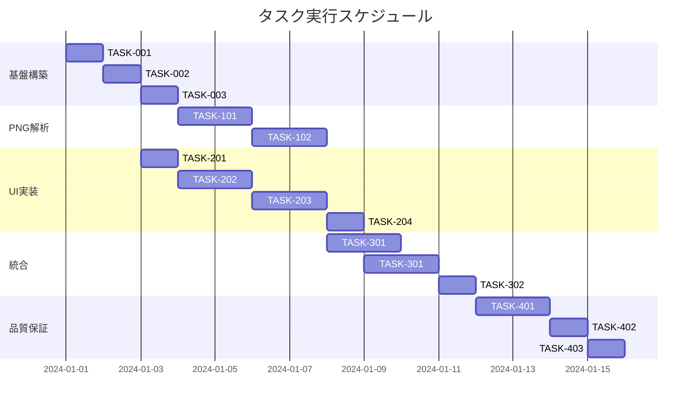

# PNG メタデータ表示機能 実装タスク

## 概要

全タスク数: 15
推定作業時間: 16-20時間
クリティカルパス: TASK-001 → TASK-002 → TASK-003 → TASK-101 → TASK-201 → TASK-301

## タスク一覧

### フェーズ1: 基盤構築

#### TASK-001: プロジェクト基本設定

- [ ] **タスク完了**
- **タスクタイプ**: DIRECT
- **要件リンク**: REQ-401, REQ-402
- **依存タスク**: なし
- **実装詳細**:
  - Next.js 14 プロジェクトの初期設定確認
  - TypeScript設定の最適化
  - Tailwind CSS設定
  - ESLint/Prettier設定
- **テスト要件**:
  - [ ] プロジェクトビルドテスト
  - [ ] TypeScript型チェックテスト
  - [ ] Lintチェックテスト
- **完了条件**:
  - [ ] `npm run build` が成功する
  - [ ] `npm run typecheck` が成功する
  - [ ] `npm run lint` が成功する

#### TASK-002: TypeScript型定義の実装

- [ ] **タスク完了**
- **タスクタイプ**: DIRECT
- **要件リンク**: REQ-004, REQ-001
- **依存タスク**: TASK-001
- **実装詳細**:
  - `src/types/png-metadata.ts` の作成
  - PNGメタデータ関連の型定義
  - UI状態管理型の定義
  - エラー型の定義
- **テスト要件**:
  - [ ] TypeScript型チェック
  - [ ] 型定義の完全性確認
- **完了条件**:
  - [ ] すべての型が適切に定義されている
  - [ ] 型エクスポートが正しく動作する

#### TASK-003: ユーティリティ関数の実装

- [ ] **タスク完了**
- **タスクタイプ**: TDD
- **要件リンク**: REQ-004, NFR-002
- **依存タスク**: TASK-002
- **実装詳細**:
  - `src/lib/file-validator.ts` の実装
  - `src/lib/utils.ts` の実装
  - ファイルサイズフォーマット関数
  - エラーオブジェクト生成関数
- **テスト要件**:
  - [ ] 単体テスト: ファイル検証ロジック
  - [ ] 単体テスト: ユーティリティ関数
  - [ ] エッジケーステスト: 境界値、不正値
- **エラーハンドリング**:
  - [ ] 無効なファイル形式
  - [ ] ファイルサイズ超過
  - [ ] 破損ファイル

### フェーズ2: PNGパーサー実装

#### TASK-101: PNG基本パーサーの実装

- [ ] **タスク完了**
- **タスクタイプ**: TDD
- **要件リンク**: REQ-004, REQ-001
- **依存タスク**: TASK-003
- **実装詳細**:
  - `src/lib/png-parser.ts` の実装
  - PNGシグネチャ検証
  - チャンク読み取り機能
  - IHDR チャンク解析
- **テスト要件**:
  - [ ] 単体テスト: PNG シグネチャ検証
  - [ ] 単体テスト: チャンク読み取り
  - [ ] 単体テスト: IHDR 解析
  - [ ] 統合テスト: 有効なPNGファイル処理
- **エラーハンドリング**:
  - [ ] 無効なPNGシグネチャ
  - [ ] 破損したチャンク
  - [ ] 不正なIHDR

#### TASK-102: メタデータ抽出器の実装

- [ ] **タスク完了**
- **タスクタイプ**: TDD
- **要件リンク**: REQ-004, 表示対象メタデータ
- **依存タスク**: TASK-101
- **実装詳細**:
  - `src/lib/metadata-extractor.ts` の実装
  - tEXt チャンク解析
  - iTXt チャンク解析
  - zTXt チャンク解析
  - tIME チャンク解析
  - pHYs チャンク解析
- **テスト要件**:
  - [ ] 単体テスト: 各チャンク解析機能
  - [ ] 統合テスト: 複数チャンク処理
  - [ ] エッジケーステスト: 空チャンク、大容量チャンク
- **エラーハンドリング**:
  - [ ] 不正なチャンクデータ
  - [ ] 文字エンコーディングエラー
  - [ ] メモリ不足

### フェーズ3: UIコンポーネント実装

#### TASK-201: 基本UIコンポーネントの実装

- [ ] **タスク完了**
- **タスクタイプ**: TDD
- **要件リンク**: REQ-002, REQ-003
- **依存タスク**: TASK-002
- **実装詳細**:
  - `src/components/ui/Card.tsx` の実装
  - `src/components/ui/Button.tsx` の実装
  - `src/components/LoadingIndicator.tsx` の実装
  - `src/components/ErrorMessage.tsx` の実装
- **UI/UX要件**:
  - [ ] ローディング状態: スピナーアニメーション
  - [ ] エラー表示: 分かりやすい日本語メッセージ
  - [ ] モバイル対応: レスポンシブデザイン
  - [ ] アクセシビリティ: ARIA属性、キーボード操作
- **テスト要件**:
  - [ ] コンポーネントテスト: レンダリング
  - [ ] スナップショットテスト
  - [ ] インタラクションテスト

#### TASK-202: ファイルアップローダーの実装

- [x] **タスク完了**
- **タスクタイプ**: TDD
- **要件リンク**: REQ-002, REQ-003, REQ-101, REQ-102
- **依存タスク**: TASK-201, TASK-003
- **実装詳細**:
  - `src/components/FileUploader.tsx` の実装
  - `src/components/DropZone.tsx` の実装
  - `src/components/FileSelectButton.tsx` の実装
  - ドラッグ&ドロップ機能
  - ファイル選択ダイアログ
- **UI/UX要件**:
  - [ ] ドラッグ状態: 視覚的フィードバック
  - [ ] ファイル検証: 即座のエラー表示
  - [ ] モバイル対応: タッチ操作最適化
  - [ ] アクセシビリティ: スクリーンリーダー対応
- **テスト要件**:
  - [ ] コンポーネントテスト: ドラッグ&ドロップ
  - [ ] コンポーネントテスト: ファイル選択
  - [ ] E2Eテスト: ファイルアップロードフロー
- **エラーハンドリング**:
  - [ ] EDGE-201: 複数ファイル同時ドロップ
  - [ ] EDGE-202: ファイル選択キャンセル

#### TASK-203: メタデータ表示コンポーネントの実装

- [ ] **タスク完了**
- **タスクタイプ**: TDD
- **要件リンク**: REQ-001, REQ-104, 表示対象メタデータ
- **依存タスク**: TASK-201
- **実装詳細**:
  - `src/components/MetadataDisplay.tsx` の実装
  - `src/components/BasicInfoCard.tsx` の実装
  - `src/components/TextMetadataCard.tsx` の実装
  - `src/components/TimestampCard.tsx` の実装
  - `src/components/PhysicalDimensionsCard.tsx` の実装
  - `src/components/OtherChunksCard.tsx` の実装
- **UI/UX要件**:
  - [ ] 読みやすい表示: NFR-202
  - [ ] 折りたたみ機能: 大量データ対応
  - [ ] モバイル対応: カード配置最適化
  - [ ] アクセシビリティ: セマンティックHTML
- **テスト要件**:
  - [ ] コンポーネントテスト: 各カード表示
  - [ ] データ表示テスト: 各種メタデータ形式
  - [ ] レスポンシブテスト

#### TASK-204: エクスポート機能の実装

- [ ] **タスク完了**
- **タスクタイプ**: TDD
- **要件リンク**: REQ-301
- **依存タスク**: TASK-203
- **実装詳細**:
  - `src/components/ExportButton.tsx` の実装
  - `src/lib/export-utils.ts` の実装
  - JSON形式エクスポート
  - CSV形式エクスポート
  - テキスト形式エクスポート
- **UI/UX要件**:
  - [ ] エクスポート形式選択UI
  - [ ] ダウンロード処理
  - [ ] プログレス表示（大容量データ時）
- **テスト要件**:
  - [ ] 単体テスト: エクスポート関数
  - [ ] 統合テスト: ダウンロード機能
  - [ ] データ整合性テスト

### フェーズ4: メインアプリケーション統合

#### TASK-301: メインページの実装

- [ ] **タスク完了**
- **タスクタイプ**: TDD
- **要件リンク**: REQ-001, REQ-201, REQ-202
- **依存タスク**: TASK-102, TASK-202, TASK-203
- **実装詳細**:
  - `src/app/page.tsx` の実装
  - アプリケーション状態管理
  - ファイル処理フロー統合
  - エラーハンドリング統合
- **UI/UX要件**:
  - [ ] 状態遷移: 適切なUI表示切り替え
  - [ ] パフォーマンス: NFR-001 (3秒以内処理)
  - [ ] モバイル対応: 全体レイアウト
  - [ ] アクセシビリティ: ページ全体の操作性
- **テスト要件**:
  - [ ] 統合テスト: 完全なユーザーフロー
  - [ ] パフォーマンステスト: ファイル処理時間
  - [ ] 状態管理テスト

#### TASK-302: レイアウトとスタイリングの実装

- [ ] **タスク完了**
- **タスクタイプ**: DIRECT
- **要件リンク**: NFR-201, NFR-302
- **依存タスク**: TASK-301
- **実装詳細**:
  - `src/app/layout.tsx` の実装
  - `src/app/globals.css` の実装
  - Tailwind CSS カスタム設定
  - レスポンシブデザイン
- **UI/UX要件**:
  - [ ] 視覚的デザイン: 分かりやすいUI
  - [ ] モバイル対応: NFR-302
  - [ ] アクセシビリティ: 色コントラスト、フォーカス表示
- **テスト要件**:
  - [ ] 視覚的回帰テスト
  - [ ] レスポンシブテスト
  - [ ] アクセシビリティテスト

### フェーズ5: 品質保証・最適化

#### TASK-401: E2Eテストスイートの実装

- [ ] **タスク完了**
- **タスクタイプ**: TDD
- **要件リンク**: 全要件
- **依存タスク**: TASK-302
- **実装詳細**:
  - Playwright/Cypress セットアップ
  - メインユーザーフローのE2Eテスト
  - エラーケースのE2Eテスト
  - パフォーマンステスト
- **テスト要件**:
  - [ ] E2Eテスト: ファイル選択→メタデータ表示
  - [ ] E2Eテスト: エラーハンドリング
  - [ ] E2Eテスト: エクスポート機能
  - [ ] パフォーマンステスト: NFR-001
  - [ ] アクセシビリティテスト
- **完了条件**:
  - [ ] 全受け入れ基準がパスする
  - [ ] パフォーマンス要件を満たす

#### TASK-402: パフォーマンス最適化

- [ ] **タスク完了**
- **タスクタイプ**: DIRECT
- **要件リンク**: NFR-001, NFR-002
- **依存タスク**: TASK-401
- **実装詳細**:
  - バンドルサイズ最適化
  - 大容量ファイル処理最適化
  - メモリ使用量最適化
  - Web Workers活用（必要に応じて）
- **テスト要件**:
  - [ ] パフォーマンステスト: 処理時間計測
  - [ ] メモリ使用量テスト
  - [ ] バンドルサイズ確認
- **完了条件**:
  - [ ] 100MBファイルが要件時間内で処理される
  - [ ] メモリリークが発生しない

#### TASK-403: ドキュメント作成とデプロイ準備

- [ ] **タスク完了**
- **タスクタイプ**: DIRECT
- **要件リンク**: 全要件
- **依存タスク**: TASK-402
- **実装詳細**:
  - README.md 更新
  - 使用方法ドキュメント作成
  - 静的ビルド設定
  - デプロイ設定（Vercel/Netlify）
- **テスト要件**:
  - [ ] 静的ビルドテスト
  - [ ] デプロイテスト
- **完了条件**:
  - [ ] 本番環境での動作確認
  - [ ] ドキュメントの完全性確認

## 実行順序

## 並行実行可能なタスク

### フェーズ2-3の並行実行
- **グループA (PNG解析)**: TASK-101, TASK-102
- **グループB (UI基盤)**: TASK-201, TASK-202, TASK-203, TASK-204

これらのグループは TASK-003 完了後に並行して開始可能

### 重要な依存関係
1. **TASK-003** → すべてのTDDタスクに必要
2. **TASK-101, TASK-102** → TASK-301 (メイン統合)
3. **TASK-202, TASK-203** → TASK-301 (メイン統合)
4. **TASK-301** → TASK-302 → TASK-401 → TASK-402 → TASK-403

## マイルストーン

1. **M1 (基盤完了)**: TASK-003 完了時点
2. **M2 (コアロジック完了)**: TASK-102 完了時点
3. **M3 (UI完了)**: TASK-204 完了時点
4. **M4 (統合完了)**: TASK-302 完了時点
5. **M5 (リリース準備完了)**: TASK-403 完了時点